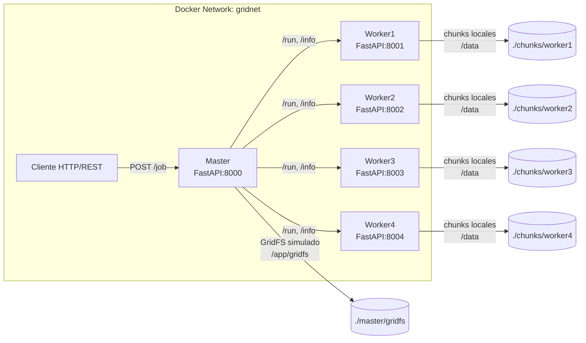

# GridMR – MapReduce Distribuido con FastAPI y Docker

[](https://fastapi.tiangolo.com/)
[](https://docs.docker.com/compose/)

> **GridMR** es una implementación ligera del patrón **MapReduce** para análisis distribuido de grandes volúmenes de texto, usando **FastAPI** y **Docker Compose**.

---

## Autores

- [Daniel Posada - **dposad13**](https://github.com/dposada13)
- [John Montoya - **jmonto98**](https://github.com/jmonto98)
- [Orleis Quiceno - **oquicen2**](https://github.com/oquicen2)

---

## 🚀 Características

- **Arquitectura Master–Workers**: un nodo maestro coordina la ejecución de tareas *Map* en varios workers y realiza la fase *Reduce*.
- **Distribución por capacidad**: cada worker procesa un número de chunks proporcional a su capacidad simulada.
- **Operaciones soportadas**:
  - **Conteo** `operation: cont`
  - **Promedios** `operation: prom`
- **Categorías soportadas**:
  - **Palabras** `category: palabras`
  - **Vocales** `category: vocales`
- **FastAPI + REST**: comunicación sencilla y escalable.
- **Docker Compose**: despliegue rápido en cualquier entorno.

---

## 🏗️ Arquitectura



---

## 📂 Estructura del proyecto

```
.
├── books                   # Libros de ejemplo
│   ├── Odisea.txt
│   └── Quijote.txt
├── master
│   ├── gridfs
│   │   └── manifests       # Manifests generados por split_file.py
│   │       ├── Odisea.manifest.json
│   │       └── Quijote.manifest.json
│   ├── app.py              # API del nodo master   
│   ├── Dockerfile
│   └── requirements.txt
├── worker
│   ├── app.py              # API de los nodos worker
│   ├── Dockerfile
│   └── requirements.txt
├── docker-compose.yml      # Docker Compose para levantar el ecosistema de nodos
├── Readme.md
├── requirements.txt
└── split_file.py           # Split de libros para simular gridfs
```

---

# Ejecución local del proyecto

## ⚙️ Requisitos previos

* [Docker](https://www.docker.com/get-started) y [Docker Compose](https://docs.docker.com/compose)
* Python 3.10+ (solo si deseas regenerar los splits antes de levantar los contenedores)

---

## Prepara el entorno local

### 1. Clonar el Repositorio

```sh
git clone https://github.com/jmonto98/gridmr.git
cd gridmr
```

### 2. Crear un entorno virtual

#### Windows

```sh
python -m venv .venv
.venv\Scripts\activate
```

#### macOS / Linux

```sh
python3 -m venv .venv
source .venv/bin/activate
```

## Configuración

1. Copia variables base:

   ```bash
   cp .env.example .env
   ```

   Define capacidades por worker, p. ej.:

   ```env
   WORKER1_CAPACITY=2
   WORKER2_CAPACITY=5
   WORKER3_CAPACITY=1
   WORKER4_CAPACITY=3
   ```

2. Coloca tus archivos `.txt` en `books/` (ej.: `Quijote.txt`, `Odisea.txt`).

3. **Genera los chunks y manifests** (particionado previo `gridfs` simulado):

   ```bash
   # Requiere Python local (o usa un contenedor temporal de python:3.11)
   python split_pile.py
   ```

   Esto creará `master/gridfs/manifests/<file>.manifest.json` y poblará `./chunks/workerX/`.

---

## ▶️ Despliegue

1. **Levantar el sistema**

   ```bash
   docker compose up --build
   ```

2. **Acceder a la API del master**

   * Documentación interactiva (Swagger): [http://localhost:8000/docs](http://localhost:8000/docs)
   * API base: [http://localhost:8000](http://localhost:8000)

---

## 🔌 Uso de la API

### Master

| Método | Endpoint   | Descripción                                |
| ------ | ---------- | ------------------------------------------ |
| `GET`  | `/workers` | Lista de workers con su capacidad y chunks |
| `GET`  | `/files`   | Muestra los datasets disponibles           |
| `POST` | `/job`     | Ejecuta la operación distribuida           |

**Ejemplo de petición:**

```json
{
  "file_key": "Quijote",
  "operation": "cont",
  "category": "palabras",
  "target": "mancha"
}
```

**Respuesta:**

```json
{
  "operation": "cont",
  "category": "palabras",
  "target": "mancha",
  "count": 58
}
```

### Workers

| Método | Endpoint | Descripción                                                               |
| ------ | -------- | ------------------------------------------------------------------------- |
| `GET`  | `/info`  | Devuelve id, capacidad y chunks disponibles                               |
| `POST` | `/run`   | Ejecuta la operación en los datos locales y devuelve el resultado parcial |

---

## Posibles errores y soluciones

- **400** solicitud inválida.
  - Revisa la estructura de la petición como se indica en líneas anteriores
- **404** `file_key` no encontrado en manifests.
  - Asegúrate de haber corrido `split_pile.py`, que existan archivos en `./chunks/workerX/` y que todos los workers tengan capacidad asigana en el .env
- **502** fallo al invocar un worker.
  - Valida que todos los nodos estén disponibles en el docker desktop. Ejecuta nuevamente `docker-compose up -d` si es necesario.

---

## 🤝 Contribuir

1. Haz un **fork** del repositorio.
2. Crea una rama para tu feature:

   ```bash
   git checkout -b feature/nueva-funcionalidad
   ```
3. Envía un **Pull Request** describiendo los cambios.

---

## 📝 Licencia

Este proyecto se distribuye bajo licencia **MIT**.
Consulta el archivo [LICENSE](LICENSE) para más detalles.
